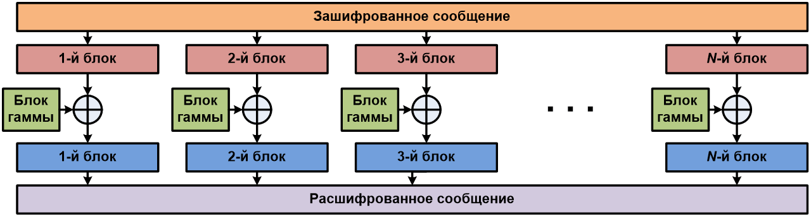
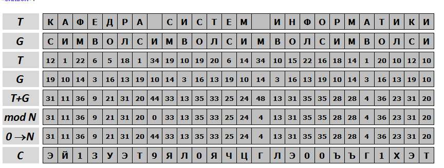

---
## Front matter
lang: ru-RU
title: Шифр гаммирования
author: Шемякин Алексей НФИбд-02-18
institute: Российский Университет Дружбы Народов
date: 11 декабря, 2021, Москва, Россия

## Formatting
mainfont: PT Serif
romanfont: PT Serif
sansfont: PT Sans
monofont: PT Mono
toc: false
slide_level: 2
theme: metropolis
header-includes: 
 - \metroset{progressbar=frametitle,sectionpage=progressbar,numbering=fraction}
 - '\makeatletter'
 - '\beamer@ignorenonframefalse'
 - '\makeatother'
aspectratio: 43
section-titles: true

---

# Цели и задачи

## Цель лабораторной работы

Освоить на практике применение режима однократного гаммирования

# Выполнение лабораторной работы

## Гаммирование

Гаммирование представляет собой наложение (снятие) на открытые (зашифрованные) данные последовательности элементов других данных, полученной с помощью некоторого криптографического алгоритма, для получения зашифрованных (открытых) данных. Иными словами, наложение
гаммы — это сложение её элементов с элементами открытого (закрытого)
текста по некоторому фиксированному модулю, значение которого представляет собой известную часть алгоритма шифрования.

## Алгоритм

{ #fig:001 }

## Алгоритм

{ #fig:002 }

## Формула

В аддитивных шифрах символы исходного сообщения заменяются числами, которые складываются по модулю с числами гаммы. Ключом шифра является гамма, символы которой последовательно повторяются.
Перед шифрованием символы сообщения и гаммы заменяются их номерами в алфавите и само кодирование выполняется по формуле

$$ Ci = (Ti+Gi) mod N $$

## Пример работы алгоритма

{ #fig:003 }

## Пример работы программы

{ #fig:004 }

## Пример работы программы 2

{ #fig:005 }

# Выводы

## Результаты выполнения лабораторной работы

Освоил на практике применение режима однократного гаммирования